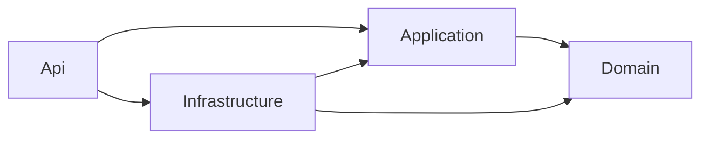

# Arquitectura de AulaPedidos

AulaPedidos administra catálogo y pedidos de una empresa. Es una API modular desplegada como una unidad, con persistencia relacional y un servicio de notificaciones separado para simular fallos de red. No incluye una interfaz comercial ni un proveedor real de identidad.

## Revisión de arquitectura con varios agentes

La organización multiagente pertenece al **proceso de desarrollo**, no a la arquitectura de ejecución de la API. Sus fases se definen una sola vez en el [protocolo multiagente](multiagente-copilot.md); las decisiones de arquitectura se justifican en un ADR. Ver [decisión del flujo](adr/004-multiagente-supervisado.md).

Una actualización inválida de `Product` debe conservar su estado y `Domain` no debe depender de EF. Estas fronteras y reglas son criterios para revisar los informes y el código.

## Reglas del negocio

Un producto tiene identidad, SKU, nombre, precio y estado de borrado lógico. Un pedido pertenece a un usuario, contiene líneas con precio histórico y no acepta cantidades inválidas. Consultar pedidos requiere comprobar pertenencia; tener permiso de lectura no concede acceso a pedidos ajenos. Cambiar datos concurrentemente requiere detectar versiones obsoletas. Cancelar no equivale a borrar la historia. Consulte los métodos y tests del dominio para las restricciones exactas de la versión entregada.

## Dependencias de compilación

Api puede referenciar Infrastructure para registrar implementaciones en el punto de composición. Los handlers de negocio no reciben esa referencia como atajo. Domain no tiene referencias a otros proyectos de la solución. La dirección de una llamada en tiempo de ejecución puede ir desde Application al repositorio concreto gracias a una interfaz; eso no invierte las referencias de compilación.

| Proyecto | Responsabilidad | Lo que debe quedar fuera |
|---|---|---|
| `src/AulaPedidos.Domain` | Entidades, reglas, estados y eventos | HTTP, EF, SQL, contenedores |
| `src/AulaPedidos.Application` | Casos de uso, contratos, puertos, Result y mediación | DbContext concreto, secretos, HttpContext |
| `src/AulaPedidos.Infrastructure` | EF, repositorios, adaptadores externos, outbox y caché | Decidir quién posee un pedido a partir del body |
| `src/AulaPedidos.Api` | Rutas, autenticación, políticas, errores, DI y telemetría | Cálculos de negocio duplicados |
| `tests/` | Evidencia de reglas, HTTP y persistencia | Pruebas que sólo reproducen el código |
| `tools/AulaPedidos.NotificationsMock` | Destino local para simular notificaciones | Datos o credenciales reales |

## Flujo principal

1. ASP.NET Core valida el token y las políticas del grupo y endpoint comprueban los permisos.
2. Un DTO captura únicamente los campos aceptados por el contrato.
3. El endpoint envía una solicitud al mediador propio; éste resuelve el handler registrado.
4. Application obtiene identidad confiable, carga productos y coordina la operación.
5. Domain aplica invariantes y genera un hecho de negocio.
6. Infrastructure persiste el agregado y el mensaje outbox en una transacción local.
7. El endpoint traduce Result a un estado HTTP documentado.
8. Un worker entrega pendientes al adaptador de notificaciones. Puede repetir una entrega; el consumidor debe tolerarla.

La superficie HTTP usa exclusivamente Minimal APIs. `Program.cs` configura el host y registra los grupos `/api/v1/products` y `/api/v1/orders`; `Endpoints` contiene mapeos, handlers HTTP, DTOs de entrada y traducción de errores. `AddValidation()` valida DataAnnotations antes del caso de uso y `TypedResults` describe las respuestas de éxito para OpenAPI. Los endpoints delegan al mediador existente y conservan la autorización sobre pedidos en Application.

## Patrones con un motivo concreto

| Patrón | Uso en AulaPedidos | Coste o límite que debe explicarse |
|---|---|---|
| Repository | `IRepository<T>` comparte carga por identidad/lote y alta; interfaces específicas expresan consultas del negocio | Seguimiento, agregados completos y unidad de trabajo mantienen su semántica; no se expone `IQueryable` a Application |
| CQRS | Solicitudes de lectura separadas de escritura | Comparten base; no implica microservicios, event sourcing ni dos bases |
| Mediator | Desacopla transporte del handler por tipo | Registro explícito y resolución deben probarse; más indirección |
| Adapter | Notificador HTTP detrás de un puerto | Contrato externo, timeouts y semántica siguen siendo responsabilidad del equipo |
| Result | Éxitos/fallos de negocio expresados como datos | No reemplaza excepciones inesperadas ni justifica omitir logging |
| Domain Events | Hechos surgidos al cambiar un agregado | No enviar I/O durante una mutación de dominio |
| Outbox | Guardado conjunto de pedido y mensaje | Entrega al menos una vez, posibles duplicados y mensajes venenosos |
| Retry | Recuperación acotada de fallo transitorio | Amplifica carga; peligro de repetir efectos no idempotentes |
| Circuit Breaker | Suspende llamadas durante una degradación | No repara el servicio ni garantiza entrega por sí solo |
| Cache Aside | Lectura de catálogo con caché e invalidación | Caché local no coordina réplicas; no es fuente de verdad |

## SOLID aplicado

SRP: un handler coordina crear pedido y no emite tokens. OCP: otro notificador puede implementar el puerto sin alterar las reglas. LSP: un repositorio debe mantener los contratos de ausencia y cancelación; una implementación que lanza inesperadamente al no encontrar viola expectativas. ISP: puertos pequeños evitan que un lector dependa de escritura. DIP: las decisiones de negocio dependen de abstracciones propias, no del SDK del proveedor. No se evalúa SOLID contando interfaces.

## Datos y consistencia

`Product` y `Order` implementan `IAggregateRoot`. Sus repositorios heredan de `Repository<T>` y de un contrato `IRepository<T>` definido en Application. Las consultas por identidad conservan seguimiento; las consultas por lote son de lectura sin seguimiento. `OrderRepository` carga las líneas en ambos casos. La inyección genérica y la específica resuelven la misma instancia scoped; los registros son explícitos para cada agregado. `IUnitOfWork` confirma cambios y outbox mediante el mismo contexto. Actualización, cancelación y borrado lógico pasan por métodos del dominio; permisos, versión e invalidación de caché permanecen en sus handlers. Ver [uso y extensión del repositorio genérico](repositorio-generico.md).

SQL Server es el proveedor del entorno de contenedores; SQLite reduce fricción en el desarrollo local. Tienen contextos y migraciones propios. Pasar pruebas con SQLite no demuestra traducción de SQL Server, bloqueo o rendimiento del servidor. El borrado lógico conserva historial, pero un filtro global no sustituye autorización ni una política de retención. Auditoría técnica de creación/modificación no equivale a un registro inmutable de cumplimiento.

Los montos se modelan como decimal. El precio del pedido se fija al crearlo para conservar su historia aunque cambie el catálogo. La concurrencia optimista permite rechazar una versión vieja; no garantiza por sí sola que cualquier nueva operación sea segura. Deben comprobarse también las invariantes del agregado y la transacción completa.

## Escalabilidad y mantenibilidad

Primero medir latencia, consultas, mensajes pendientes y errores; después decidir índices, caché o réplicas. La estructura admite reemplazar adaptadores y probar reglas aisladamente. No demuestra capacidad para una cantidad de usuarios no medida. Antes de escalar el worker se necesita reclamar mensajes atómicamente, tolerar duplicados y definir retención. Antes de escalar la API se revisan caché, límites, conexión a DB y coordinación de tareas. Ver [producción](produccion.md) y los [ADR](adr/).
