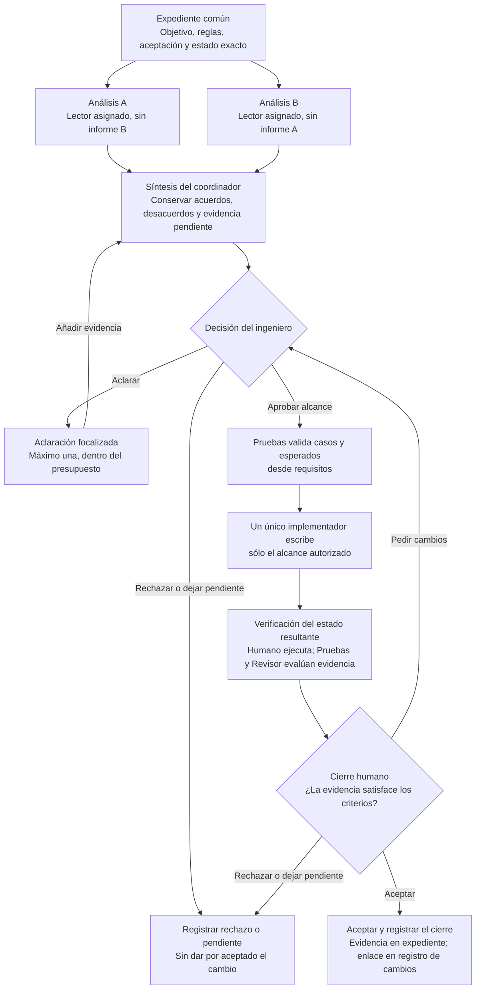

# Flujo multiagente supervisado con Copilot

Este proyecto adopta consulta separada y síntesis inspiradas en [Lokomotiv](https://docs.rs/crate/lokomotiv/latest), una herramienta externa de orquestación de varios modelos. Lokomotiv no se instala ni se presenta como patrón oficial o integración nativa de GitHub Copilot. El flujo agrega decisión humana, un solo escritor de implementación y evidencia de comportamiento. El Coordinador puede conservar el expediente tras confirmación humana de cada guardado.

Dos respuestas no son dos verificaciones. Cambiar la etiqueta de un rol tampoco crea otro agente. La calidad se demuestra con reglas, código, pruebas y observaciones; el ingeniero conserva la responsabilidad.

## Cómo funciona el flujo

El diagrama siguiente resume el recorrido, incluida la aclaración, el rechazo y el cierre. Los análisis nacen en sesiones separadas sin leer el informe contrario: eso no exige simultaneidad ni garantiza errores independientes. La aprobación final siempre corresponde al humano; no se activa automáticamente al terminar las pruebas.

El retorno para pedir cambios no autoriza nuevas rondas ilimitadas. El ingeniero acota la corrección; si cambia una premisa o el estado base, actualiza el expediente y repite los análisis afectados. Revisor y Pruebas son lectores; el implementador puede ejecutar comprobaciones autorizadas en Visual Studio, y el humano conserva la verificación independiente y la decisión de cierre.

## Protocolo de cambio

Aplicar el ciclo a cada cambio significativo. Los cambios menores pueden reutilizar expediente y decisión mientras conserven el alcance autorizado; no abrir otra ronda completa por cada línea. Actualizar la evidencia afectada cuando cambie el estado.

| Fase | Responsable | Entrada y salida comprobables |
|---|---|---|
| E. Expediente | Ingeniero con coordinador | Objetivo, reglas, aceptación, riesgos, archivos permitidos, estado exacto y presupuesto; Coordinador guarda tras confirmación humana |
| A/B. Consulta separada | Dos lectores asignados para la ronda | Mismo paquete común congelado; informes originales sin recibir la respuesta del otro |
| S. Síntesis | Coordinador | Comparación de A/B, acuerdos, desacuerdos, evidencia faltante y recomendación; guardado del expediente confirmado |
| D. Decisión | Ingeniero | Opción y justificación, alcance autorizado y pendientes; casos de Pruebas basados en requisitos |
| I. Implementación | Un implementador designado | Cambio acotado de código, tests y documentación, con diff rastreable |
| V. Verificación | Pruebas, revisor y humano | Matriz de casos, salidas reales, revisión del diff y contraejemplos |
| C. Cierre | Ingeniero | Aceptar, pedir cambios o rechazar; Coordinador registra la decisión real y conserva la actualización confirmada |

Pruebas y Revisor son lectores distintos del implementador. A/B identifican informes, no perfiles fijos: la ronda puede asignar Arquitecto/Pruebas, Arquitecto/Revisor o Revisor/Pruebas según el riesgo. El expediente registra la asignación. Pruebas diseña casos antes del cambio y evalúa sus resultados después; Revisor inspecciona el diff final en una sesión nueva aunque haya participado inicialmente. Los comandos independientes los ejecuta la persona responsable. Si se necesita corregir, sólo el implementador escribe y se vuelve a verificar el diff actualizado.

El expediente incluye identificación del repositorio o directorio de trabajo, commit y cambios locales (diff y archivos nuevos), versiones relevantes, archivos de contexto, regla y origen del resultado esperado, criterios positivo, negativo y de borde, exclusiones, permisos y condición de parada. Sin Git, conservar una copia identificada de los archivos base y registrar esa limitación. No cambiar código durante A/B. Si cambia el estado, actualizar expediente y repetir los análisis afectados.

Guardar los informes sólo después de que ambos terminen, o mantenerlos fuera del contexto accesible de la otra consulta. El Coordinador incorpora los originales al expediente sólo tras ambas consultas y confirmación humana de guardado. A/B reciben únicamente el paquete común congelado; no adjuntar al pedir B un expediente que ya contenga A ni enlaces a ese informe. En síntesis, una tabla punto/A/B/evidencia/decisión pendiente evita perder la propuesta minoritaria. Si un agente no corrió, no tuvo contexto o agotó tiempo, escribir «pendiente» y reducir alcance; nunca reemplazarlo con una respuesta inventada.

Presupuesto de la ronda: una consulta inicial A/B y como máximo una aclaración. Análisis y síntesis tienen 10 minutos de referencia, ajustables por la persona responsable antes de iniciar según el riesgo y el alcance. Si no se resuelve a tiempo, registrar la decisión pendiente y reducir alcance o acordar otra ronda; no entrar en debate ilimitado ni inventar consenso.

Sin Copilot, acceso o cuota, realizar dos análisis manuales separados sobre el mismo paquete. Conservar las fases, la evidencia técnica y la decisión humana; registrar «contingencia sin IA» y la revisión pendiente. No inventar agentes, respuestas ni ejecución.

### Una sola ubicación para cada evidencia

| Documento | Qué se guarda allí |
|---|---|
| Expediente de cambio | `docs/expedientes/<ID>.md`: registro detallado único con enlace al paquete, estado, A/B originales, síntesis, decisión, diff, pruebas, revisión y cierre |
| Paquete común | `docs/expedientes/<ID>.paquete-comun.md`: requisitos y estado base congelados para A/B, sin informes ni síntesis |
| Registro de cambios | Índice de evidencia: enlace al expediente, decisión breve y pendientes por cambio |
| Cierre del cambio | Índice de evidencias y ejecución del proyecto; enlaza, no transcribe el ciclo |

Los informes y salidas grandes pueden ser archivos sanitizados enlazados desde el expediente. La persona responsable conserva esta evidencia; el Coordinador puede incorporar sus enlaces con confirmación. «Un escritor» restringe las ediciones de código, pruebas y documentación técnica del cambio; el Coordinador se ocupa de los documentos del proceso autorizados. No editar simultáneamente el mismo archivo ni rellenar el expediente y los índices con la misma transcripción.

### Guardado del expediente por el Coordinador

El Coordinador puede crear o actualizar sólo `docs/expedientes/<ID>.md` y `docs/expedientes/<ID>.paquete-comun.md` dentro del directorio de trabajo identificado. Por ejemplo, `docs/expedientes/CATEGORY-001.md`. La [guía de expedientes](expedientes/README.md) muestra el intercambio de confirmación. Los registros previos en subcarpetas pueden mantenerse manualmente; no se migran ni sobrescriben automáticamente.

Antes de cada guardado muestra las rutas exactas y el contenido propuesto o diff. La persona revisa y confirma explícitamente esa operación; el Coordinador guarda el contenido confirmado y registra quién confirmó y qué se autorizó. No repite una confirmación ya recibida para el mismo contenido y destino. Contenido nuevo requiere otra confirmación. Conserva decisiones previas, informes originales y procedencia; si detecta cambios ajenos en el archivo, presenta una actualización conciliada antes de pedir confirmación. Si no dispone de edición, entrega el texto para guardado manual y registra la limitación.

El paquete común queda congelado antes de A/B. No lo modifica durante las consultas ni añade informes o síntesis; un cambio de premisa o estado exige identificar otra versión y repetir los análisis afectados. Cuando el expediente acumule informes, sólo el paquete común se adjunta a los lectores iniciales.

Confirmar el guardado documental no autoriza implementar ni aceptar el cambio. El Coordinador puede conservar una propuesta de cierre con decisión pendiente; sólo registra aceptación, corrección o rechazo cuando el humano lo haya decidido explícitamente. No modifica código, pruebas, documentación técnica, bitácoras, plantillas ni configuración, no ejecuta comandos y no delega escritura. Esta delimitación de rutas es una instrucción de alcance; la herramienta de edición no ofrece por sí sola ese aislamiento. Comprobar permisos efectivos y revisar el diff.

## Ruta principal en Visual Studio 2026

1. Preparar perfiles con [Harness Copilot](harness-copilot.md). Registrar versión, modelo y herramientas reales. Implementar en el repositorio o directorio de trabajo identificado. Antes de editar otro destino, registrar su estado y el alcance autorizado.
2. Preparar expediente y paquete común mediante `.github/prompts/multiagente.prompt.md`. El humano fija los resultados de negocio esperados y confirma rutas y contenido; el Coordinador los guarda en `docs/expedientes/` y congela el paquete antes de A/B.
3. Abrir dos chats nuevos con los perfiles A/B asignados para la ronda, sólo el archivo `<ID>.paquete-comun.md`, los archivos de contexto permitidos y el prompt técnico apropiado. Por ejemplo, Arquitecto analiza opciones y Pruebas deriva casos. El segundo no recibe el informe del primero. Se pueden ejecutar secuencialmente; describirlo como consulta separada manual.
4. Abrir Coordinador y adjuntar expediente, A/B completos y `sintesis.prompt.md`. Revisar y confirmar el diff para guardar originales, desacuerdos y comprobaciones pendientes. El humano decide el alcance de implementación; Pruebas revisa la matriz de aceptación.
5. Abrir Implementador con decisión explícita y prompt de feature/refactor o reparación aprobado. Inspeccionar herramientas y cambios. Ningún otro chat modifica código, tests ni documentación técnica de implementación. El Coordinador sólo guarda sus documentos de proceso confirmados; no hay edición simultánea del mismo archivo.
6. Revisar diff en una nueva sesión de Revisor y evaluar casos/salidas con Pruebas. Con `cierre.prompt.md`, el humano decide el cierre y confirma la actualización documental; el Coordinador guarda evidencia y decisión final en el expediente. La persona añade sólo su enlace y decisión breve al registro de cambios. Documentar también lo rechazado.

Los perfiles en `.github/agents/` son de Visual Studio; crear archivos no activa coordinación automática. Los nombres de herramientas provienen de [Microsoft Learn](https://learn.microsoft.com/en-us/visualstudio/ide/copilot-specialized-agents?view=visualstudio) y se comprueban localmente. No trasladar configuraciones de VS Code a Visual Studio.

## Ruta opcional de delegación real en Copilot CLI

Es una extensión opcional. Utiliza el mismo expediente y fases; sólo cambia la coordinación de A/B. Preparación, perfiles, permisos, comandos y comprobación de tareas reales están en la [guía CLI](../ejemplos/copilot-cli/README.md). No mezclar sus herramientas con las de Visual Studio ni afirmar que hubo subagentes sólo porque existen perfiles.

## Criterios de evidencia

- A/B corresponden al mismo expediente y estado; se conservan originales y referencias consultadas.
- La síntesis identifica desacuerdos y supuestos comunes; no aprueba por votación.
- La decisión de implementación pertenece al humano y precede a la edición de código, pruebas y documentación técnica. Sólo hay un implementador escritor; el Coordinador guarda exclusivamente el expediente y paquete común tras confirmación humana de rutas y contenido. No hay ediciones simultáneas del mismo archivo.
- Al menos un caso negativo procede de una regla comprobable, no del código generado.
- Pruebas y revisor separan observado, inferido y pendiente. Se identifica quién ejecutó cada comando y sobre qué estado.
- La modalidad se declara con precisión: manual, subagentes realmente observados o contingencia sin IA. Un requisito pendiente impide declararlo completado.

Estas son decisiones del proyecto, no capacidades garantizadas por el producto. Fuentes consultadas el 4 de octubre de 2026. La verificación documental no sustituye una comprobación autenticada en el entorno objetivo, con sus versiones y políticas.
